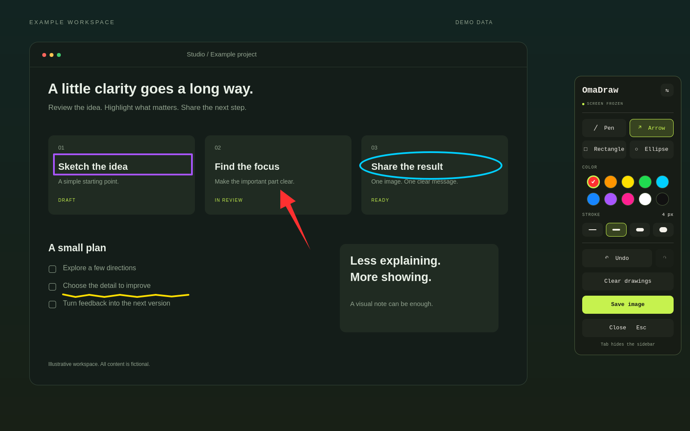
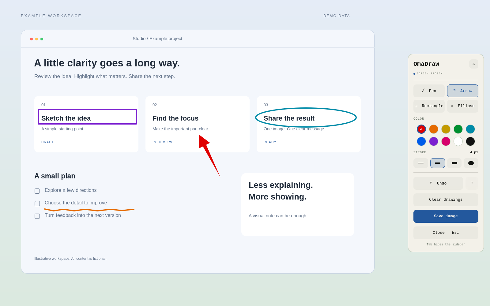
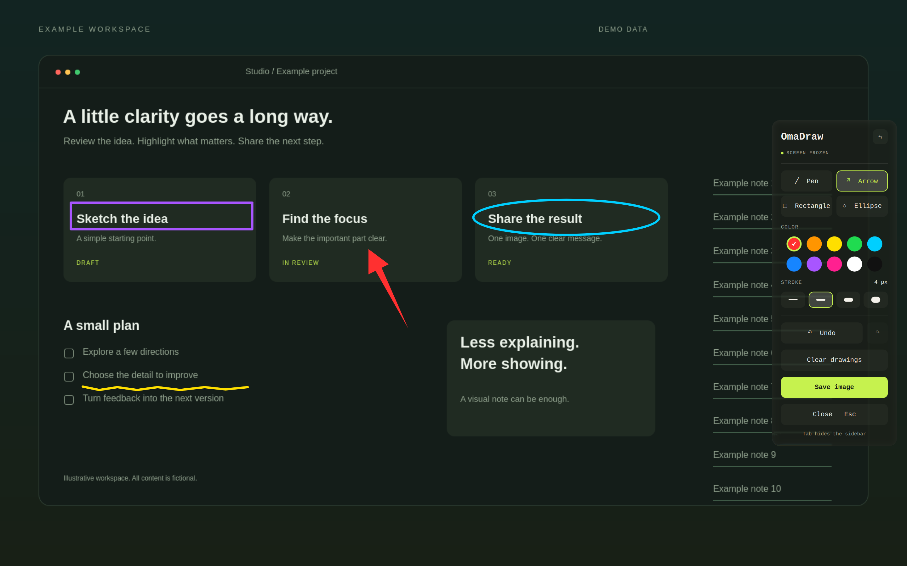

# OmaDraw

Freeze your screen. Draw the point. Keep your flow.

OmaDraw is an **Omarchy Quattro screen annotation plugin** with a native sidebar, vivid drawing colors and optional integration with the system's Liquid Glass material. The interface and documentation are in English.



All demonstration images use an original fictional workspace. They contain no personal desktop content, account information, messages or real project data.

## Features

- **Super + D** opens and closes the editor after shortcut setup. **Esc** also closes it.
- Freeze the active monitor while applications continue running underneath.
- Smooth freehand pen, filled tapered arrows, rectangles and ellipses. Hold **Shift** for a square or circle.
- Ten vivid colors with separate light/dark palettes. Theme accents never replace annotation colors, and changing the theme preserves existing drawings.
- The sidebar follows the Omarchy theme's colors, typography, controls and corner radius.
- If the system's compatible **HyprGlass / Liquid Glass** integration is already active, the sidebar inherits its material. The frozen image and ink remain unchanged.
- Clear drawings and start again on the same frozen image. Undo also restores cleared drawings.
- Save a PNG at the original monitor resolution, without controls, and continue drawing.
- Hide the sidebar with **Tab**, or move it to the opposite side.

Drawing style is inspired by [Tensaku](https://github.com/jondkinney/tensaku). OmaDraw has its own QML/Cairo implementation and does not require Tensaku.

## Install

Requires **Omarchy Quattro with the Quickshell shell and Lua Hyprland configuration**. It is not compatible with the older Waybar-based Omarchy shell.

```bash
omarchy plugin add https://github.com/BrunooMoniz/omadraw --enable
```

Then configure the shortcut and compositor integration:

```bash
~/.config/omarchy/plugins/io.github.brunoomoniz.desenhar/install.sh
```

Running this script explicitly adds a marked block to `~/.config/hypr/bindings.lua`. It backs up the file, refuses a conflicting **Super + D**, validates the result and restores the file if validation fails. Existing marked configuration is left unchanged. Installing or opening the plugin alone does not rewrite your configuration.

To open without configuring a shortcut:

```bash
omarchy-shell shell toggle io.github.brunoomoniz.desenhar
```

Runtime dependencies: `quickshell`, Qt Quick/Controls/Layouts, `hyprland`, `grim`, `python`, `python-cairo`, `xdg-user-dirs`, and the Omarchy shell/notification commands. Shortcut setup also uses `ripgrep` and Git when installing from a source checkout. These are normally provided by the target Omarchy environment; this plugin does not install packages and runs entirely as the logged-in user.

Liquid Glass is **optional** and is not installed or enabled by this plugin. Integration currently recognizes the active system marker at `~/.local/state/omarchy/liquid-glass-install/enabled` and the `hl.plugin.hyprglass.layer` Lua API. Other glass setups can register only the `omarchy-desenhar-toolbar` namespace with their existing material. Keep `omarchy-desenhar` excluded so the captured image is not refracted.

## Controls

| Action | Shortcut |
| --- | --- |
| Open / close | Super + D, after setup |
| Close and discard session | Esc |
| Pen / arrow / rectangle / ellipse | P / A / R / O |
| Constrain rectangle or ellipse | Shift while dragging |
| Undo / redo | Ctrl + Z / Ctrl + Shift + Z |
| Save PNG | Ctrl + S |
| Clear drawings | Delete |
| Hide / show sidebar | Tab |

Images are saved in the system's Pictures directory under `Annotations/`. If `OMARCHY_SCREENSHOT_DIR` is set, that directory is used instead of Pictures, still with the `Annotations/` subdirectory.

## Privacy and limits

Only the active monitor is frozen. Opening a new session takes a new capture; this is a frozen-frame editor, not an annotation layer over live moving video.

Captures remain local in a private directory under `XDG_RUNTIME_DIR` and are removed when closing. After an abrupt process exit, remaining temporary captures expire with the login session. Saved PNGs use owner-only permissions. The plugin sends no images to a server, performs no telemetry and does not automatically copy images to the clipboard.

Physical multi-monitor and rotated-output setups have not yet been verified. Automated rendering covers scaled export; native interaction was verified with a 1.6 scale factor.

## Update and remove

```bash
omarchy plugin update io.github.brunoomoniz.desenhar
```

If your shell keeps an old component in memory after an update, close the editor and run `omarchy restart shell`.

To remove, first close the editor and remove only the block between `-- >>> io.github.brunoomoniz.desenhar >>>` and `-- <<< io.github.brunoomoniz.desenhar <<<` in `~/.config/hypr/bindings.lua`, including the markers. Then:

```bash
omarchy plugin remove io.github.brunoomoniz.desenhar
hyprctl reload
hyprctl configerrors
```

Saved images remain untouched. To temporarily stop using the plugin, run `omarchy plugin disable io.github.brunoomoniz.desenhar` instead.

## Gallery

### Dark theme


### Light theme



### Liquid Glass



The light/dark images are rendered from the real editor components. The glass image uses the real compositor with an injected synthetic image; the helper never captures a personal desktop to make the demo.

## Development

Run `./tests/run.sh`. Tests cover drawing interactions, pixels, history, theme changes, export, temporary-file cleanup, shortcut setup and optional glass registration. Development tests additionally need `lua` and Qt's `qmltestrunner`.

`./preview.sh` launches an isolated native preview. It prints the runtime path used by `qs ipc -p PATH call preview open`, `close`, `state` and `quit`.

The reproducible demonstration source is in [`demo/`](demo/README.md). Local test evidence is ignored by Git.

## License

[MIT](LICENSE), including the original demonstration scenes and images. Third-party Omarchy, Qt, Cairo and HyprGlass remain governed by their respective licenses. This is a community plugin, not an official Omarchy component or endorsement.
